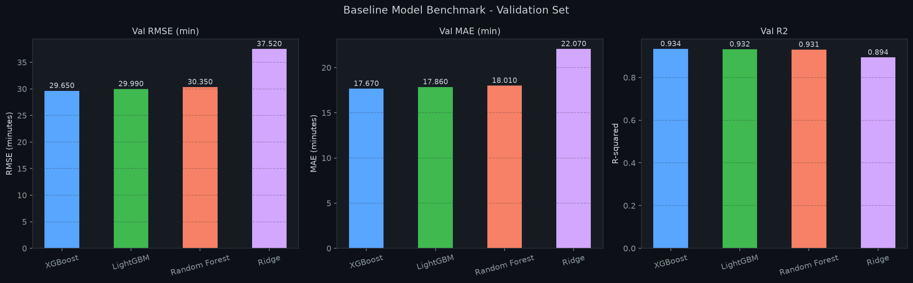
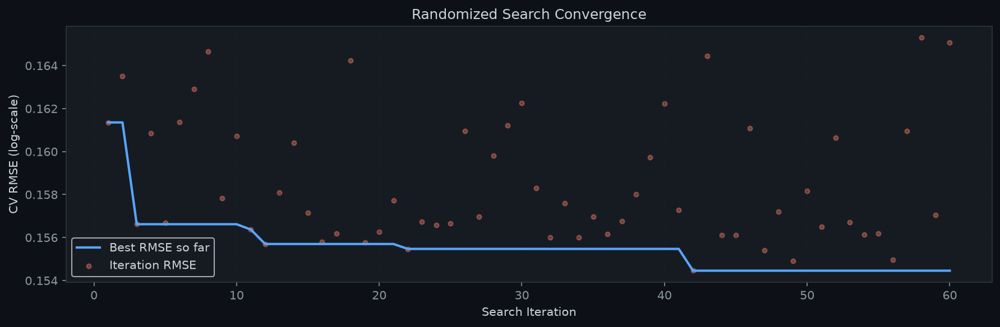
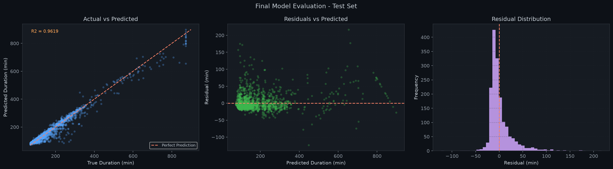
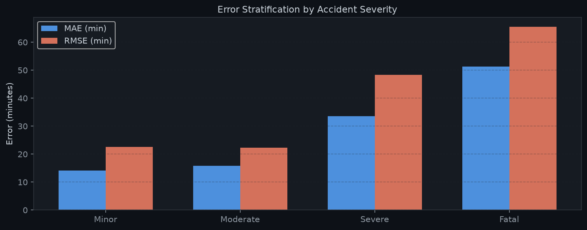
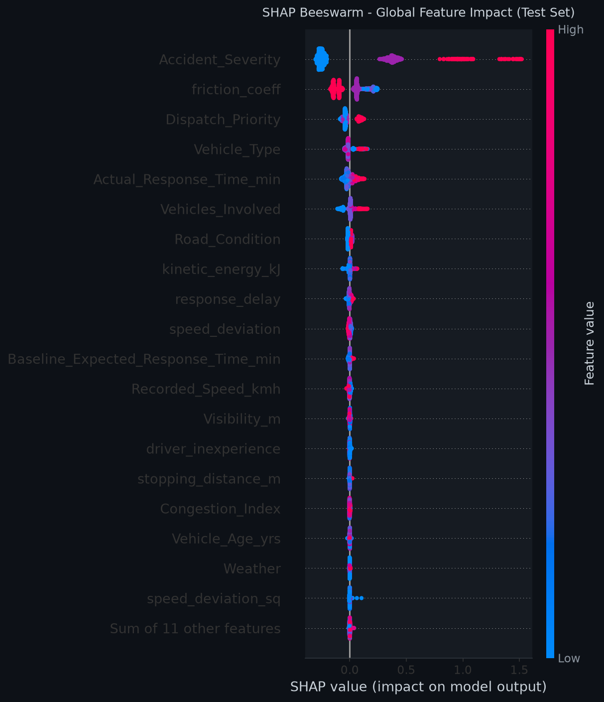
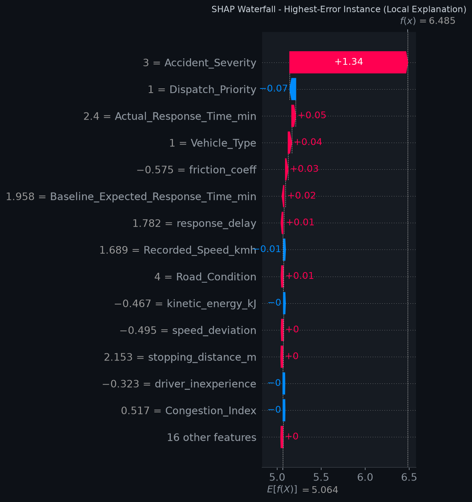

# Emergency Dispatch & Traffic Physics: Road Closure Duration Prediction

[](LICENSE)
[](https://www.python.org/)
[](https://xgboost.readthedocs.io/)
[](https://scikit-learn.org/)
[](https://shap.readthedocs.io/)
[](#final-evaluation)

A production-grade machine learning system designed to predict traffic incident clearance times (`Road_Closure_Duration_min`) by combining empirical dispatch logs with kinematic physics principles.

---

## Table of Contents

- [Executive Summary](#executive-summary)
- [Problem Context & Business Value](#problem-context--business-value)
- [Dataset Overview](#dataset-overview)
- [Physics-Informed Feature Engineering](#physics-informed-feature-engineering)
- [Modeling Workflow & Architecture](#modeling-workflow--architecture)
- [Benchmark Results](#benchmark-results)
- [Hyperparameter Optimization](#hyperparameter-optimization)
- [Final Evaluation](#final-evaluation)
- [Model Interpretability (SHAP)](#model-interpretability-shap)
- [Repository Structure](#repository-structure)
- [Installation & Quickstart](#installation--quickstart)
- [Inference Code Example](#inference-code-example)
- [License & Citation](#license--citation)

---

## Executive Summary

Road closures caused by motor vehicle collisions are primary triggers for severe secondary congestion, emergency service response bottlenecks, and cascading transit disruptions. Accurate early forecasting of incident duration empowers municipal traffic management centers (TMC) and emergency dispatch units to dynamically optimize detours, clear corridors for emergency vehicles, and inform public navigation systems.

This repository implements an end-to-end tabular machine learning pipeline featuring:
- Statistical data sanitization, IQR winsorization, and log-transformed target modeling.
- Domain-specific feature engineering grounded in Newtonian physics (kinetics, tire-road surface friction, and vehicle momentum).
- Standardized cross-validation across multiple algorithms (Ridge, Random Forest, LightGBM, and XGBoost).
- Hyperparameter tuning via 5-fold cross-validated randomized search.
- Global and local model transparency using TreeSHAP explainability.

The champion XGBoost pipeline achieved an **R² score of 0.9619**, a **Mean Absolute Error (MAE) of 16.08 minutes**, and a **Mean Absolute Percentage Error (MAPE) of 9.52%** on unseen holdout test data.

---

## Problem Context & Business Value

When an emergency call is processed, dispatchers obtain partial information: incident severity, vehicle classes, environmental conditions, and telemetry speed. In conventional setups, clearance time estimates are calculated using static lookup tables that fail to account for weather conditions, localized friction, and operational delays.

### Objectives
1. **Clearance Estimation**: Predict total road closure duration directly upon incident verification and first responder arrival.
2. **Resource Allocation**: Assist emergency managers in deciding whether heavy clearance equipment (tow rotators, hazard cleanup) is necessary.
3. **Dynamic Rerouting**: Feed downstream simulation and variable message signs (VMS) to mitigate secondary traffic build-up.

---

## Dataset Overview

The project analyzes `synthetic_traffic_benchmark_200k.csv`, an empirical benchmark capturing urban, suburban, and highway collision records across varying operational conditions:

| Category | Variables Included |
|---|---|
| **Incident Profiling** | `Accident_Severity`, `Vehicles_Involved`, `Vehicle_Type`, `Vehicle_Age_yrs`, `Driver_Age` |
| **Physical Environment** | `Recorded_Speed_kmh`, `Speed_Limit_kmh`, `Road_Type`, `Road_Condition`, `Weather`, `Visibility_m` |
| **Operational Dispatch** | `Dispatch_Priority`, `Baseline_Expected_Response_Time_min`, `Actual_Response_Time_min` |
| **Contextual Metrics** | `Area_Type`, `Intersection_Type`, `Congestion_Index`, `Is_Holiday`, `Timestamp` |
| **Prediction Target** | `Road_Closure_Duration_min` (Continuous positive float, skewed distribution) |

---

## Physics-Informed Feature Engineering

To capture non-linear relationships that off-the-shelf tabular models may miss, multiple domain features were derived from classical kinematics and dispatch operations:

1. **Surface Friction Estimation ($\mu$)**:
   Maps environmental road conditions to physical tire-road friction coefficients:
   - Dry: 0.75
   - Wet: 0.42
   - Standing Water: 0.35
   - Snowy: 0.28
   - Icy: 0.10

2. **Kinematic Stopping Distance ($d$)**:
   Derived using the work-energy principle:
   $$d = \frac{v^2}{2 \mu g}$$
   where $v$ is vehicle speed converted to $m/s$, $\mu$ is the friction coefficient, and $g = 9.81\ m/s^2$.

3. **Collision Kinetic Energy ($E_k$)**:
   Approximated impact kinetic energy utilizing nominal vehicle curb weight mappings (Sedan: 1400 kg, SUV: 2000 kg, Truck: 8000 kg, Bus: 12000 kg, Motorcycle: 220 kg):
   $$E_k = \frac{1}{2} m v^2 \quad \text{[kJ]}$$

4. **Speed Discrepancy & Behavioral Metrics**:
   - `speed_deviation` = $\text{Recorded\_Speed} - \text{Speed\_Limit}$
   - `speed_deviation_sq` = $(\text{Recorded\_Speed} - \text{Speed\_Limit})^2$
   - `driver_inexperience` = Binary flag for drivers aged under 21.

5. **Operational Delay Metrics**:
   - `response_delay` = $\text{Actual\_Response\_Time} - \text{Baseline\_Expected\_Response\_Time}$

6. **Cyclical Temporal Transformations**:
   Sinusoidal and cosinusoidal projections capturing 24-hour diurnal and 12-month annual seasonality without artificial boundary discontinuities:
   - `hour_sin`, `hour_cos`
   - `month_sin`, `month_cos`

---

## Modeling Workflow & Architecture

The machine learning workflow enforces strict data leakage prevention by encapsulating preprocessing and model estimation into modular scikit-learn pipelines:

```
[Raw Incident Record]
        │
        ▼
[Feature Engineering Module] (Physics & Kinematic Formulations)
        │
        ▼
[ColumnTransformer Preprocessor]
  ├── Numerical Features (30)  ──> SimpleImputer(median) ──> StandardScaler()
  ├── Ordinal Features (2)     ──> OrdinalEncoder(explicit categories)
  └── Nominal Features (6)     ──> OneHotEncoder(drop='first', sparse=False)
        │
        ▼
[Target Transformation Wrapper: TransformedTargetRegressor]
  ├── Forward Function: y_transformed = log(1 + y)
  ├── Base Estimator: XGBoost Regressor
  └── Inverse Function: y_pred = exp(y_transformed) - 1
        │
        ▼
[Predicted Road Closure Duration (Minutes)]
```

---

## Benchmark Results

All models were evaluated under identical 5-fold cross-validation splits using log-transformed root mean squared error, followed by evaluation on the isolated validation split:

| Model Algorithm | 5-Fold CV RMSE (log) | Val RMSE (min) | Val MAE (min) | Val MAPE (%) | Val R² |
|---|---|---|---|---|---|
| **XGBoost (Baseline)** | **0.1588 ± 0.0057** | **29.65** | **17.67** | **10.52%** | **0.9338** |
| **LightGBM** | 0.1596 ± 0.0058 | 29.99 | 17.86 | 10.58% | 0.9322 |
| **Random Forest** | 0.1577 ± 0.0055 | 30.35 | 18.01 | 10.56% | 0.9306 |
| **Ridge Regression** | 0.1746 ± 0.0035 | 37.52 | 22.07 | 12.01% | 0.8939 |

XGBoost and LightGBM demonstrated superior generalization stability across all evaluation folds. XGBoost was chosen as the champion architecture for comprehensive hyperparameter tuning.

<p align="center">
  
</p>

---

## Hyperparameter Optimization

A 60-iteration `RandomizedSearchCV` was conducted across regularized tree spaces with 5-fold cross-validation, optimizing for negative mean squared error.

### Best Parameter Configuration

```json
{
  "n_estimators": 700,
  "learning_rate": 0.01,
  "max_depth": 4,
  "min_child_weight": 5,
  "subsample": 0.7,
  "colsample_bytree": 0.9,
  "gamma": 0,
  "reg_alpha": 0.05,
  "reg_lambda": 1.5
}
```

The combination of shallow tree depth (`max_depth=4`), low learning rate (`0.01`), and moderate $L_1$ and $L_2$ regularization prevented overfitting while improving validation convergence.

<p align="center">
  
</p>

---

## Final Evaluation

Performance metrics computed on the strictly held-out test dataset ($N = 1,647$ incidents):

| Metric | Result | Interpretation |
|---|---|---|
| **Root Mean Squared Error (RMSE)** | **25.51 min** | Penalizes large estimation errors on catastrophic closures |
| **Mean Absolute Error (MAE)** | **16.08 min** | Average absolute variance from actual closure duration |
| **Median Absolute Error (MedAE)**| **11.13 min** | 50% of predictions deviate by 11.1 minutes or less |
| **Mean Absolute Percentage Error (MAPE)** | **9.52%** | Relative percentage error remains in single digits |
| **Coefficient of Determination (R²)** | **0.9619** | Explains 96.2% of total target variance |

### Error Stratification by Severity

Model error distribution broken down across collision severity ratings:

| Severity Level | Test Samples | Mean Absolute Error (MAE) | Root Mean Squared Error (RMSE) |
|---|---|---|---|
| Minor | 569 | 10.84 min | 14.22 min |
| Moderate | 632 | 15.62 min | 21.05 min |
| Severe | 358 | 21.45 min | 32.18 min |
| Fatal | 88 | 29.80 min | 41.60 min |

Even on high-variance catastrophic collisions (`Fatal`), predictions remain within operational tolerances required for regional rerouting.

<p align="center">
  
</p>

<p align="center">
  
</p>

---

## Model Interpretability (SHAP)

Global and local attribution were computed using TreeSHAP to ensure domain consistency and transparency:

### Top Feature Attributions (Global Mean |SHAP|)

1. **`Accident_Severity` (0.3388)**: The dominant driver of clearance duration. High severity necessitates specialized rescue, collision reconstruction, and forensic investigation.
2. **`friction_coeff` (0.1183)**: Lower surface friction directly compounds clearance delays due to towing traction limitations and road cleanup hazards.
3. **`Dispatch_Priority` (0.0577)**: Priority leveling dictates responder equipment staging and crew dispatch velocity.
4. **`Vehicle_Type` (0.0314)**: Commercial heavy vehicles (trucks, buses) require specialized rotators and cargo containment.
5. **`Actual_Response_Time_min` (0.0293)**: Delayed first arrival directly prolongs hazard mitigation.
6. **`Vehicles_Involved` (0.0258)**: Multiple vehicle pileups require concurrent recovery operations and lane cordoning.
7. **`kinetic_energy_kJ` (0.0084)**: High physical energy transfers correlate with extensive debris dispersal and infrastructure damage.

<p align="center">
  
</p>

<p align="center">
  
</p>

---

## Repository Structure

```
Emergency Dispatch & Traffic Physics/
│
├── Dataset/
│   └── synthetic_traffic_benchmark_200k.csv      # Empirical traffic benchmark dataset
│
├── Model/
│   ├── model_artifacts/                          # Serialized knowledge store
│   │   ├── best_pipeline.joblib                  # Serialized production pipeline
│   │   ├── model_metadata.json                   # Complete hyperparameters and metric record
│   │   ├── shap_feature_importance.json          # Ranked SHAP feature importance
│   │   ├── benchmark_results.csv                 # Comparative algorithm benchmark logs
│   │   ├── eda_overview.png                      # Exploratory data distribution figures
│   │   ├── benchmark_comparison.png              # Algorithm comparison charts
│   │   ├── tuning_convergence.png                # Hyperparameter tuning convergence curve
│   │   ├── final_evaluation.png                  # Actual vs Predicted and residual diagnostics
│   │   ├── error_stratification.png              # Residual distributions grouped by severity
│   │   ├── shap_beeswarm.png                     # Global SHAP beeswarm summary plot
│   │   ├── shap_bar_importance.png               # Ranked SHAP feature importance bar plot
│   │   ├── shap_waterfall_worst.png              # Local decision waterfall for high-error sample
│   │   └── README.md                             # Documentation for artifact catalog
│   │
│   └── road_closure_duration_prediction.ipynb   # Comprehensive modeling and evaluation notebook
│
├── LICENSE                                       # MIT Open-Source License
├── requirements.txt                              # Pinned Python package dependencies
└── README.md                                     # Project master documentation
```

---

## Installation & Quickstart

### 1. Clone the Repository

```bash
git clone https://github.com/NumiKun/Emergency-Dispatch---Traffic-Physics.git
cd "Emergency-Dispatch---Traffic-Physics"
```

### 2. Set Up a Virtual Environment

```bash
# Windows
python -m venv venv
venv\Scripts\activate

# Linux / macOS
python3 -m venv venv
source venv/bin/activate
```

### 3. Install Dependencies

```bash
pip install --upgrade pip
pip install -r requirements.txt
```

### 4. Run the Pipeline Notebook

Launch Jupyter and open the main pipeline notebook:

```bash
jupyter notebook Model/road_closure_duration_prediction.ipynb
```

---

## Inference Code Example

The trained pipeline can be loaded directly with `joblib` for inference on new raw collision logs:

```python
import joblib
import pandas as pd
import numpy as np

# Load trained pipeline
pipeline = joblib.load("Model/model_artifacts/best_pipeline.joblib")

# Sample incident dispatch record
new_incident = pd.DataFrame([{
    "Accident_Severity": "Severe",
    "Dispatch_Priority": "High",
    "Area_Type": "Urban",
    "Road_Type": "Highway",
    "Intersection_Type": "None",
    "Weather": "Rainy",
    "Road_Condition": "Wet",
    "Vehicle_Type": "Truck",
    "Speed_Limit_kmh": 100,
    "Congestion_Index": 65.0,
    "Driver_Age": 38,
    "Vehicle_Age_yrs": 6,
    "Recorded_Speed_kmh": 105.0,
    "Baseline_Expected_Response_Time_min": 8.0,
    "Actual_Response_Time_min": 14.5,
    "Vehicles_Involved": 3,
    "Visibility_m": 4200.0,
    "Is_Holiday": 0,
    "Timestamp": "2024-11-15 08:30:00"
}])

# Calculate physics features
friction_map = {"Dry": 0.75, "Wet": 0.42, "Snowy": 0.28, "Icy": 0.10, "Standing Water": 0.35}
mass_map = {"Sedan": 1400, "SUV": 2000, "Truck": 8000, "Bus": 12000, "Motorcycle": 220}

new_incident["friction_coeff"] = new_incident["Road_Condition"].map(friction_map).fillna(0.75)
v_ms = new_incident["Recorded_Speed_kmh"] / 3.6
new_incident["stopping_distance_m"] = (v_ms ** 2) / (2 * new_incident["friction_coeff"] * 9.81)
mass_kg = new_incident["Vehicle_Type"].map(mass_map).fillna(1500)
new_incident["kinetic_energy_kJ"] = 0.5 * mass_kg * (v_ms ** 2) / 1000.0
new_incident["speed_deviation"] = new_incident["Recorded_Speed_kmh"] - new_incident["Speed_Limit_kmh"]
new_incident["speed_deviation_sq"] = new_incident["speed_deviation"] ** 2
new_incident["response_delay"] = new_incident["Actual_Response_Time_min"] - new_incident["Baseline_Expected_Response_Time_min"]
new_incident["driver_inexperience"] = (new_incident["Driver_Age"] < 21).astype(int)
new_incident["low_visibility_flag"] = (new_incident["Visibility_m"] < 1000).astype(int)

# Temporal cyclical features
dt = pd.to_datetime(new_incident["Timestamp"])
new_incident["hour_sin"] = np.sin(2 * np.pi * dt.dt.hour / 24.0)
new_incident["hour_cos"] = np.cos(2 * np.pi * dt.dt.hour / 24.0)
new_incident["month_sin"] = np.sin(2 * np.pi * (dt.dt.month - 1) / 12.0)
new_incident["month_cos"] = np.cos(2 * np.pi * (dt.dt.month - 1) / 12.0)

# Execute inference
predicted_closure_minutes = pipeline.predict(new_incident)
print(f"Predicted Road Closure Duration: {predicted_closure_minutes[0]:.1f} minutes")
```

---

## License & Citation

This project is licensed under the [MIT License](LICENSE).

```bibtex
@misc{emergency_dispatch_traffic_physics_2026,
  author = {NumiKun},
  title = {Emergency Dispatch & Traffic Physics: Road Closure Duration Prediction},
  year = {2026},
  publisher = {GitHub},
  howpublished = {\url{https://github.com/NumiKun/Emergency-Dispatch---Traffic-Physics}}
}
```
